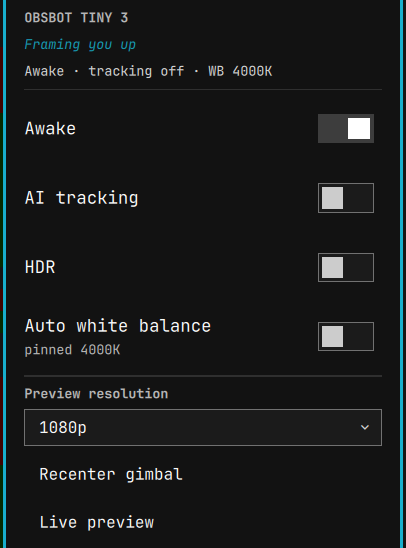

# OBSBOT Tiny 3 — Omarchy bar widget

A native [Omarchy](https://omarchy.org/) / Quickshell bar widget to control an
**OBSBOT Tiny 3 series** webcam: a camera icon in the bar that opens a popup with
sleep/wake, AI tracking, HDR, white balance, a preview-resolution picker, and a
live video preview.

<p align="center">
  
</p>

- **Bar icon** — pulses while the camera is in use; left-click opens the popup,
  right-click toggles sleep, middle-click opens the live preview.
- **Popup** — toggle switches for sleep/wake, AI tracking, HDR, and auto white
  balance; a preview-resolution dropdown (720p/1080p/2160p); recenter; and a
  **Live preview** button.

The widget respects the camera's ability to sleep: it reads only the cheap USB
power state in the background (nothing is opened), and only the live preview
streams the camera — which is released the moment the preview window closes.

## Requirements

This widget is a front-end for the **obsbot-tiny3-linux** CLI. Install that
project **first** by following its own instructions, then make sure the `t3ctl`
and `t3-preview` commands it provides are on your `PATH`:

- Project & install guide: <https://github.com/joshualambert/obsbot-tiny3-linux>

The live preview additionally uses [`mpv`](https://mpv.io/) (install it with your
distribution's package manager). This widget itself installs nothing, runs no
privileged commands, and writes no configuration of its own — it only invokes the
`t3ctl` / `t3-preview` commands you installed above.

## Install

From the Omarchy plugin marketplace:

```
omarchy plugin install io.github.joshualambert.obsbot-tiny3
```

Then add the widget to your bar — put this entry in the `right` (or `left` /
`center`) list under `bar.layout` in `~/.config/omarchy/shell.json`:

```json
{ "id": "io.github.joshualambert.obsbot-tiny3" }
```

and reload the shell:

```
omarchy restart shell
```

## Removal

Remove the `{ "id": "io.github.joshualambert.obsbot-tiny3" }` entry from
`~/.config/omarchy/shell.json`, then:

```
omarchy plugin disable io.github.joshualambert.obsbot-tiny3
omarchy plugin remove io.github.joshualambert.obsbot-tiny3
omarchy restart shell
```

The widget writes no configuration of its own and never modifies your files.

## License

MIT — see [`LICENSE`](LICENSE). Part of the **obsbot-tiny3-linux** project:
<https://github.com/joshualambert/obsbot-tiny3-linux>
